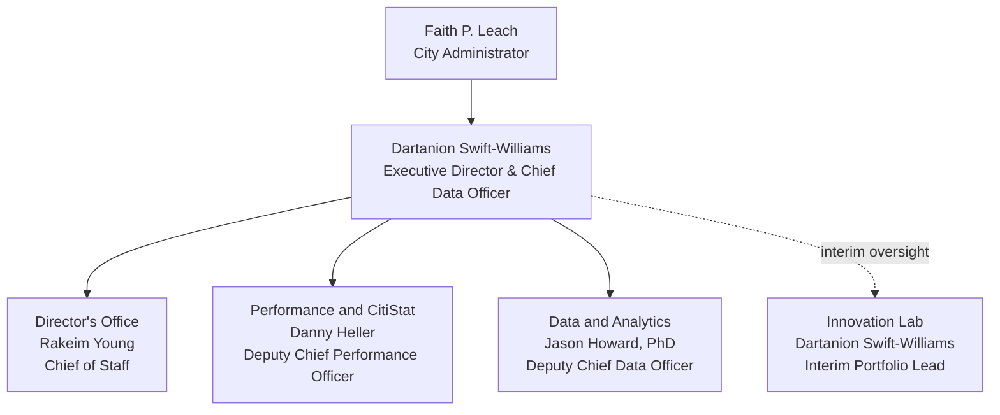

# Org Structure

<span class="opi-pill approved">Approved</span>

> Who reports to whom, and how decision rights flow.

*Portfolios, leads, staff alignment, services, cost centers, and the Cross-Agency Delivery overlay.*
OPI delivers its mission through four portfolios and five services. The portfolios are how we organize people, leadership, and cost centers. The services are how we describe what OPI delivers to residents, agencies, and City leadership.

This document is the canonical view of OPI’s FY27 structure: leads, staff alignment, portfolios, services, cost centers, and the Cross-Agency Delivery overlay.

> *Better government is not a one-time project. It is a discipline.*

## Leadership org chart

This chart shows the named leadership structure and portfolio ownership. Staff
alignment appears below in one chart per portfolio so the reporting lines stay
readable.



## Staff alignment by portfolio

Each portfolio gets its own chart so the roster stays readable on desktop and
mobile. Innovation Lab work is currently staffed through cross-portfolio
assignments, so those contributors appear under their home teams instead of
being duplicated in a separate Lab roster.

=== "Director's Office"

    ```mermaid
    flowchart TB
      DOLead["Rakeim Young<br/>Chief of Staff"]
      DO1["Mallory Screws<br/>Project Manager"]
      DO2["Derek Thomas<br/>Special Assistant"]
      DO3["Rashaad Tillery<br/>CitiStat Inspector"]
      DO4["Audrey Randazzo<br/>Communications and Partnerships Lead"]
      DO5["Chiemeka Okeoma<br/>Senior Product Engineer"]
      DO6["Xander Jake de los Santos<br/>Product Engineer"]

      DOLead --> DO1
      DOLead --> DO2
      DOLead --> DO3
      DOLead --> DO4
      DOLead --> DO5
      DOLead --> DO6
    ```

=== "Performance and CitiStat"

    ```mermaid
    flowchart TB
      PCLead["Danny Heller<br/>Deputy Chief Performance Officer"]
      PC1["Darren Lu<br/>CitiStat Program Manager"]
      PC2["Ethan Buckborough<br/>CitiStat Analyst"]
      PC3["Nelson Gomes Boronat<br/>CitiStat Analyst"]
      PC4["Ross Hackett<br/>CitiStat Analyst"]
      PC5["Griffin Riddler, PhD<br/>CitiStat Analyst"]
      PC6["Vacant<br/>Senior Performance Analyst"]

      PCLead --> PC1
      PCLead --> PC2
      PCLead --> PC3
      PCLead --> PC4
      PCLead --> PC5
      PCLead --> PC6
    ```

=== "Data and Analytics"

    ```mermaid
    flowchart TB
      DALead["Jason Howard, PhD<br/>Deputy Chief Data Officer"]
      DA1["Roberto Herbruger<br/>Technical Program Manager"]
      DA2["Vera Choo<br/>Analytics Lead"]
      DA3["Selenea Gibson<br/>Applied Data Scientist"]
      DA4["Koby Samuel<br/>Principal Platform Engineer"]
      DA5["Alejandro Zuniga Sosa<br/>Principal Data Engineer"]
      DA6["Briya Bhakta<br/>Senior Data Engineer"]
      DA7["Sam Wilson<br/>Open Data Program Manager"]
      DA8["Addisalem Abera<br/>Data Engineer"]

      DALead --> DA1
      DALead --> DA2
      DALead --> DA3
      DALead --> DA4
      DALead --> DA5
      DALead --> DA6
      DALead --> DA7
      DALead --> DA8
    ```

=== "Innovation Lab"

    ```mermaid
    flowchart TB
      ILLead["Dartanion Swift-Williams<br/>Interim Portfolio Lead"]
      IL1["Dedicated roles<br/>Standing up in FY27"]
      IL2["Contributors work from<br/>Home portfolios"]

      ILLead -.-> IL1
      ILLead -.-> IL2
    ```

**SECTION 1**

**The Four Portfolios**

OPI’s work is organized into four portfolios, each with a named lead, a budget cost center, a defined set of functions, and a primary value proposition.

| **Portfolio**            | **Lead**                                                                         | **Cost Center**          | **Primary Value**                                                                                                                      |
|--------------------------|----------------------------------------------------------------------------------|--------------------------|----------------------------------------------------------------------------------------------------------------------------------------|
| Director’s Office        | Rakeim Young, Chief of Staff                                                     | AdminOps                 | Operating backbone that keeps work prioritized, documented, communicated, and deliverable.                                             |
| Performance and CitiStat | Danny Heller, Deputy Chief Performance Officer                                   | Performance and CitiStat | Owns the performance method; translates priorities into routines, measures, follow-up, and improvement.                                |
| Data and Analytics       | Jason Howard, PhD, Deputy Chief Data Officer                                     | Data and Analytics       | Builds trusted data infrastructure and decision-ready analytics; supports CitiStat, transparency, agency operations, and AI readiness. |
| Innovation Lab           | Dartanion Swift-Williams, interim until Innovation Program Manager is identified | Innovation Lab           | Turns service problems into designed, usable, testable solutions; coordinates handoff to data, engineering, agency, or BCIT partners.  |

**SECTION 2**

**Current Staff Alignment**

The alignment below reflects OPI’s current operating chart. It will be updated as vacancies are filled or roles are formally reclassified.

**Director’s Office**

- Rakeim Young — Chief of Staff

- Mallory Screws — Project Manager

- Derek Thomas — Special Assistant

- Rashaad Tillery — CitiStat Inspector

- Audrey Randazzo — Communications and Partnerships Lead

- Chiemeka Okeoma — Senior Product Engineer

- Xander Jake de los Santos — Product Engineer

**Performance and CitiStat**

- Danny Heller — Deputy Chief Performance Officer

- Darren Lu — CitiStat Program Manager

- Ethan Buckborough — CitiStat Analyst

- Nelson Gomes Boronat — CitiStat Analyst

- Ross Hackett — CitiStat Analyst

- Griffin Riddler, PhD — CitiStat Analyst

- TBD — Senior Performance Analyst

**Data and Analytics**

- Jason Howard, PhD — Deputy Chief Data Officer

- Roberto Herbruger — Technical Program Manager

- Vera Choo — Analytics Lead

- Selenea Gibson — Applied Data Scientist

- Koby Samuel — Principal Platform Engineer

- Alejandro Zuniga Sosa — Principal Data Engineer

- Briya Bhakta — Senior Data Engineer

- Sam Wilson — Open Data Program Manager

- Addisalem Abera — Data Engineer

**Innovation Lab**

Dartanion Swift-Williams serves as interim portfolio lead. Innovation work is currently supported through a cross-portfolio model and will be formalized when the Innovation Program Manager role is identified and filled.

**SECTION 3**

**Cost Centers and Budget Services**

Cost centers govern budget and expense management. Budget services describe what OPI delivers. Cross-Agency Delivery is tracked as a service overlay unless and until dedicated staff or budget are assigned.

**Cost Centers**

| **Cost Center**          | **Description**                                                                                                                                                                                                              |
|--------------------------|------------------------------------------------------------------------------------------------------------------------------------------------------------------------------------------------------------------------------|
| AdminOps                 | Personnel and operating costs for OPI executive support, communications, portfolio management, intake, knowledge management, fiscal, HR, facilities, Council relations, quality assurance, and agencywide operations.        |
| Performance and CitiStat | Personnel and operating costs for CitiStat, citywide performance management, agency performance planning, performance measures, follow-up tracking, performance analysis, and performance method stewardship.                |
| Data and Analytics       | Personnel and operating costs for analytics, data platform development, data engineering, data governance, open data, GIS and spatial analytics, data literacy, and responsible data and AI readiness.                       |
| Innovation Lab           | Personnel and operating costs for human-centered design, product discovery, service design, prototyping, operational tools, civic technology, applied innovation projects, strategic partnerships, and AI innovation pilots. |

**Five Services**

OPI’s services describe the value we deliver, regardless of which portfolio or staff member is involved.

- Citywide Performance Management — administered by Performance and CitiStat.

- Citywide Data and Analytics — administered by Data and Analytics.

- Innovation Lab — administered by the Innovation Lab portfolio.

- Cross-Agency Delivery — service overlay; activated when Mayor, City Administrator, or Deputy Mayor priorities require coordinated action across agencies.

- AdminOps — administered by the Director’s Office.

**SECTION 4**

**Cross-Agency Delivery Overlay**

Cross-Agency Delivery is an OPI-wide service overlay, not a standalone cost center at this stage. It is activated for Mayor, City Administrator, or Deputy Mayor priorities that require coordinated action across agencies.

Danny Heller serves as Interim Delivery Manager, stewarding delivery discipline and cross-agency coordination. Rakeim Young maintains portfolio visibility, intake, status reporting, and escalation tracking through the Director’s Office.

| **Element**                         | **Operating Decision**                                                                                                                                              |
|-------------------------------------|---------------------------------------------------------------------------------------------------------------------------------------------------------------------|
| Status                              | Service overlay. Not a separate cost center or fully staffed portfolio yet.                                                                                         |
| Interim Delivery Manager            | Danny Heller                                                                                                                                                        |
| Portfolio visibility and escalation | Rakeim Young / Director’s Office                                                                                                                                    |
| Primary triggers                    | Mayor, City Administrator, or Deputy Mayor priorities; major CitiStat follow-up failures; recurring cross-agency blockers; executive-priority implementation needs. |
| Activation decision                 | Executive Director, with input from OPI leadership and relevant executive sponsors.                                                                                 |
| Execution model                     | Assigned lead by activation; time-boxed delivery rooms or working sessions; status tracked through Portfolio Council and weekly leadership reporting.               |

**SECTION 5**

**How to Read This Structure**

Three lenses help staff, partners, and leadership read OPI:

- Portfolios are how we organize people, leads, and budgets.

- Services are how we describe what we deliver to residents, agencies, and City leadership.

- Cost centers are how we account for resources, track spend, and submit our budget request.

When work is intaken, we ask: which portfolio holds the lead? Which service does the work belong to? And which cost center funds it? When the answer is clear, the work moves. When the answer is unclear, intake routes the question to the Director’s Office for triage.

> *We move with urgency, but not chaos.*
