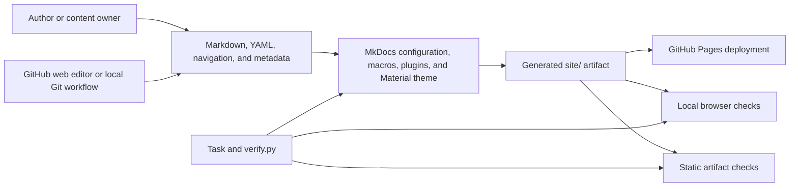

# Technical Specification

**Status:** Proposed repository contract for maintainer review. Architecture
evidence was verified against the repository on 2026-07-30. This document
describes implemented behavior and named assurance limits; it is not published
by MkDocs.

This specification explains how OPI Foundations turns maintained Markdown and
structured data into a static website, verifies it locally, and publishes it
through GitHub Pages. The
[Product Requirements](product-requirements.md) own what the product must do.
[User Stories](user-stories.md) own the journeys and acceptance criteria. This
document owns the technical seams that implement and prove those contracts.

## System summary

OPI Foundations is a static documentation site:

- no application backend, database, authenticated runtime, or API;
- Markdown and bounded YAML under `docs/` are build input;
- MkDocs, Material, Python-Markdown, PyMdown, plugins, and repository macros
  produce `site/`;
- repository CSS and JavaScript enhance the generated HTML without creating a
  separate application state model;
- GitHub Actions builds the artifact and GitHub Pages serves it; and
- a container provides local preview only and never enters the deployment path.

The machine-readable declaration is
[`.baltimore-lab-app.toml`](../.baltimore-lab-app.toml): `kind = "docs-site"`,
uv packaging, Python 3.14, registry slot 8, and GitHub Pages deployment. The
shared Patapsco baseline rules for backends, databases, Redis, nginx, and Bromo
do not apply to this repository kind.

## System context



No reader request reaches Python, a database, or a City data source. Python runs
at build and verification time. Browser JavaScript operates only on generated
HTML and local Material state.

## Technical invariants

The following boundaries are design constraints, not implementation
suggestions:

1. `docs/` is the only MkDocs publication source. Root `product/` is
   repository documentation and must not enter Wiki navigation or output.
2. `mkdocs.yml` owns global runtime configuration. The nearest `.pages` file
   owns section navigation and order.
3. Generated `site/` output is ignored and never edited as source.
4. Shared data is loaded once and rendered through shared macros. A new
   renderer must not introduce a parallel parser or organization model.
5. Local preview binds the registered host port to loopback. The container may
   bind internally to all interfaces only behind that loopback publication.
6. GitHub Pages is the deployment path. Docker Compose is a developer
   convenience.
7. Verification stays in the nested `ci`, `prepush`, and `validate` plans.
   New claims enter the cheapest authoritative tier.
8. A visible change needs a product decision and focused evidence. A business
   meaning, access rule, actor, metric, or audit-history change needs its named
   owner.

## Source authority map

| Concern | Authoritative source | Contract |
| --- | --- | --- |
| Product purpose and scope | [Product Requirements](product-requirements.md) | Audiences, capabilities, commitments, boundaries, and owner decisions |
| Journeys | [User Stories](user-stories.md) | Current state and observable acceptance criteria |
| Shared engineering baseline | [`AGENTS.md`](../AGENTS.md) and Patapsco | Gate, task, port, pin, and estate rules |
| Global MkDocs behavior | [`mkdocs.yml`](../mkdocs.yml) | Site URL, source directory, exclusions, theme, plugins, Markdown, redirects, and search |
| Section navigation | `docs/**/.pages` | Reader labels, order, and local hierarchy |
| Page maintenance metadata | `docs/**/.metadata.yml` | Owner, last review, next review, and change note |
| Shared organization data | [`docs/_data/people.yml`](../docs/_data/people.yml) | Canonical team, person, role, and reporting records |
| Shared build-time components | [`main.py`](../main.py) and [`scripts/repo_tools/`](../scripts/repo_tools/) | Validated data loading and HTML generation |
| Material presentation | [`overrides/`](../overrides/) and [`docs/assets/`](../docs/assets/) | Bounded templates, design tokens, styles, and interaction adapters |
| Command surface | [`Taskfile.yml`](../Taskfile.yml) | Setup, preview, build, and nested verification entry points |
| Verification plans | [`scripts/verify.py`](../scripts/verify.py) | Ordered checks, timeouts, reporting, and fail-fast behavior |
| Product-document links | [`scripts/check_product_contract_links.py`](../scripts/check_product_contract_links.py) | Relative targets, local heading fragments, and repository-bound traversal |
| Pull-request gate | [`.github/workflows/ci.yml`](../.github/workflows/ci.yml) | Fast source-only `task ci` |
| Pages build and deploy | [`.github/workflows/deploy.yml`](../.github/workflows/deploy.yml) | `task prepush`, artifact upload, and Pages deployment |
| Local container preview | [`Dockerfile`](../Dockerfile) and [`docker-compose.yml`](../docker-compose.yml) | Pinned image, non-root process, live reload, port publication, and health |

When two sources appear to disagree, the narrower authority wins only inside its
declared concern. A `.metadata.yml` owner, for example, owns page review; it
does not establish product decision rights.

## Repository and publication boundaries

[`mkdocs.yml`](../mkdocs.yml) sets `docs_dir: docs` and strict mode. MkDocs
excludes:

- `_data/`;
- `*.cards.yml`; and
- `*.data.yml`.

Those files may drive build-time rendering, but they are not downloadable
pages. Pages under `docs/how-we-work/handbook/` are part of the rendered Wiki
and follow the same navigation and metadata rules as other content pages.

Root `product/` is excluded by location, not by a fragile ignore pattern. The
repository-wide authored-source discovery still sees root Markdown for the
source-language contract, and the fast product-contract link ratchet validates
its relative targets and local heading fragments. Docs-only checks, including
page metadata and the editorial style checker, do not automatically govern
`product/`. Reviewers must therefore evaluate these contracts as repository
documentation and must not claim that every published-content validator covers
them.

## Content and navigation model

Published pages are Markdown under `docs/`. Four companion file types keep
repeated structure out of page prose:

| Source | Responsibility |
| --- | --- |
| `.pages` | Section label, navigation membership, and order |
| `.metadata.yml` | Build-time page maintenance ownership and review dates |
| `*.cards.yml` | Repeated landing-page card content |
| `*.data.yml` | Structured page-specific content that drives more than one rendered view |

Metadata is validation and governance input. The current templates do not show
the metadata owner or review dates to readers. The product decision about a
visible treatment remains in
[Decision 9](product-requirements.md#decision-9-should-pages-show-their-owner-and-review-date).

The `awesome-pages` plugin consumes local `.pages` files. The redirects plugin
consumes the compatibility map in `mkdocs.yml`. MkDocs' search plugin builds the
client-side search index; the product has no external search service.

Adding, moving, renaming, or deleting a page requires the nearest `.pages`,
landing cards, metadata, links, and any needed redirect to move in the same
slice. A strict build and built-link crawl prove generated internal resolution.
They do not prove the health of external destinations.

## Build-time data and macros

[`main.py`](../main.py) registers four public macro surfaces:

- `card_grid_from()` loads validated card data and renders the shared card
  component;
- `page_header()` renders explicit category, summary, and tagline arguments;
- `org_structure()` renders the canonical organization views; and
- `role_holder()` resolves a role from the same organization model.

The functions delegate parsing and rendering to
[`scripts/repo_tools/`](../scripts/repo_tools/). `main.py` remains a thin
registration boundary. Data paths are confined beneath `docs/`, YAML uses a
safe loader with duplicate-key rejection, and I/O failures become actionable
build errors.

Macro output is marked as trusted because it is produced at build time from
reviewed repository data, not from a reader request or runtime input. Moving a
runtime or untrusted input through that boundary would invalidate the security
assumption and requires a redesign.

### Organization model

[`docs/_data/people.yml`](../docs/_data/people.yml) is the only organization
record consumed by renderers. Validation enforces the exact four-team order,
allowed fields, identifiers, role relationships, and value types.

Rendered organization fields are limited to names, working titles, team
assignments, reporting relationships, and short role summaries. The source also
retains each team's `primary_value`, but renderers intentionally do not use it
while the Executive Director decides whether to restore, move, or retire it.
The schema must not silently remove that deferred field.

Schema validation proves shape and relationships. It does not prove that a
title, assignment, or reporting line is factually current. The content owner
remains responsible for that review.

## Rendering and client behavior

The build pipeline is:

```text
docs Markdown and YAML
        |
        v
repository data loaders and macros
        |
        v
MkDocs + Python-Markdown + PyMdown + plugins
        |
        v
Material templates + bounded overrides + repository CSS and JavaScript
        |
        v
site/ static artifact
```

Material provides the document shell, navigation, search, appearance schemes,
edit and source actions, tables, and Markdown behavior. Repository overrides
add the civic header, breadcrumbs, homepage opening, page tools, and accessible
labels. CSS is split into tokens, base content, Material chrome, navigation,
shared components, organization charts, breadcrumbs, and homepage concerns.

The client scripts adapt Material's existing state:

- native header controls project the drawer and search checkbox state;
- appearance controls project Material's palette radio state;
- focus, inert state, Escape behavior, and instant-navigation handoff are
  synchronized with those controls.

The scripts do not create a single-page application, router, data store, or
second open-and-closed state model. Without JavaScript, top-level navigation
remains visible and keyboard-native. Search is suppressed because its results
runtime is unavailable; this is useful fallback, not full feature parity.

## Canonical URLs and local preview

Production uses
`https://city-of-baltimore.github.io/opi-wiki/`. Native local preview uses
`http://127.0.0.1:5208`.

`task serve` starts MkDocs on that registered loopback port. Slot 8 and port
5208 are recorded in `.baltimore-lab-app.toml` and Patapsco's shared port
registry. The port must change in the registry before it changes locally.

Docker Compose publishes `127.0.0.1:5208` to the container's
`0.0.0.0:8000`, bind-mounts source for live reload, and isolates the container
virtual environment and generated output. The image runs as a non-root user and
uses a digest-pinned Astral uv base image.

MkDocs rewrites `site_url` during `serve`.
[`scripts/mkdocs_site_url.py`](../scripts/mkdocs_site_url.py) validates and
restores `OPI_SITE_URL` so the container's reader-visible origin and `/opi-wiki/`
base path remain canonical. Plain HTTP is accepted only for a loopback host.
The Docker health probe requires a nonredirecting HTTP 200 from `/opi-wiki/`.

Docker is never a production fallback. A Compose success proves local preview,
not GitHub Pages availability.

## Build and deployment flow

Pull-request CI installs pinned Python, uv, and Task tooling, then runs
`task ci`. The hosted lane is intentionally source-only: no pytest, strict
build, or browser process.

A push to `main` starts the Pages workflow:

1. check out the merged commit;
2. install the pinned toolchain and locked dependencies;
3. run `task prepush` with the production `OPI_SITE_URL`;
4. upload the resulting `site/` directory as the Pages artifact; and
5. deploy that saved artifact through `actions/deploy-pages`.

The container is absent from this path. The workflow does not run
`task validate`, a post-deploy browser smoke, or an uptime check. It proves that
the merged source passes pre-push assurance and produces an uploadable
artifact. It does not prove Pages uptime, DNS or TLS behavior, external-link
availability, recovery time, backup retention, or successful reader reach
after deployment.

## Verification architecture

[`scripts/verify.py`](../scripts/verify.py) defines the three nested plans once,
runs them in order, closes child-process input, applies a 600-second per-step
timeout, fails fast, reports timings, and can write a machine-readable JSON
report.

| Tier | Command | Added assurance |
| --- | --- | --- |
| Fast source | `task ci` | Hosted policy and browser-readiness contracts; platform evidence and baseline; Python formatting, lint, typing, and Bandit; page metadata; organization data; brand and editorial terms; consistency; raw HTML links; repository product-document links |
| Pre-push | `task prepush` | The fast plan, pytest, one strict build, rendered-language checks, artifact safety, built internal links, and static accessibility |
| Browser release | `task validate` | The pre-push plan, focused browser smoke, and the full-route accessibility matrix |

The Taskfile currently invokes `ci:policy` before calling `verify.py`, and every
verification plan begins with the same hosted-policy check. The guard therefore
runs twice in a top-level tier. It is fast and intentional today, but it is a
measured exception to the prove-once rule. This specification must not hide it
or generalize it into permission for further duplication. Retire it only in a
focused gate slice that proves one invocation preserves both direct-task and
plan enforcement.

The pre-push hook is the local backstop for tests and builds. Git permits a
developer to bypass it with `--no-verify`; a web editor also cannot run it. The
Pages workflow runs the pre-push plan again before publication, so the
deployment artifact receives that proof even when the local hook did not.

### What each layer does not prove

- Source checks do not prove the site builds or a reader can complete a browser
  interaction.
- Pytest proves repository automation contracts without launching the release
  browser suites.
- Strict build and built-link checks prove the generated artifact and its
  internal links, not external URLs.
- Automated accessibility checks do not prove screen-reader clarity, reading
  order quality, 200% or 400% zoom, custom text spacing, or useful alternative
  text.
- Browser validation is a documented release requirement, but the Pages
  workflow does not enforce it mechanically.
- No gate proves reader comprehension, task success, GitHub Pages availability,
  or a recovery objective.

## Static and live browser models

The browser tools deliberately separate a release artifact from a running
preview.

### Static artifact

Static checks read the canonical origin and routes from the strict-built
`sitemap.xml`. A route cap prevents accidental unbounded crawls. Playwright
intercepts every request and serves exact artifact bytes inside Chromium
without DNS, TLS, or ordinary network access. Unknown, missing, unsafe,
out-of-base, and out-of-origin requests fail locally.

Exact Adobe and Google font origins are the only nonblocking cross-origin
exception, limited to font, image, or stylesheet resource types. This proves
that core workflows do not depend on vendor delivery. It does not prove which
font Chromium painted or whether a vendor is available.

### Live preview

Live diagnostics read the selected preview's own `sitemap.xml`, require its
origin and base path to match, and make real requests to the running preview.
Readiness is a canonical load, visible rendered content, and settled font
loading. It never uses `networkidle`, because MkDocs live reload keeps a
long-lived request open.

The audit browser aborts only its own same-origin numeric `/livereload/` XHR so
a route crawl does not accumulate 60-second polls. Ordinary preview browsers
retain live reload.

### Browser coverage

The smoke suite crawls canonical routes for response status, final URL, runtime
errors, and focused navigation, header, table, organization, and homepage
behaviors. Accessibility uses axe and reflow checks across desktop and
320-pixel light and dark contexts, plus focused skip-link and interaction
states.

The pinned Chromium engine and selected viewports are regression evidence, not
a browser-support policy. Product
[Decision 11](product-requirements.md#decision-11-which-browsers-and-devices-does-opi-support)
must define that policy before the suite expands.

## Accessibility boundary

OPI Foundations targets WCAG 2.2 Level AA. The published
[Accessibility service standard](../docs/resources/accessibility.md) owns the
reader-facing commitment and the distinction between automated and human
proof.

Static checks own repeated semantic failures. Browser tests own interaction,
focus, responsive state, axe, and measured reflow. People still own meaning,
heading and reading order quality, keyboard experience, zoom, text spacing,
screen-reader clarity, and alternative text.

A structural navigation, template, or shared-component change needs focused
human review in addition to the applicable automated tier. The repository does
not currently contain a dated manual screen-reader, zoom, or custom
text-spacing report, so those experiences remain partially assured.

## Security, privacy, and source placement

The published product has no accounts, session, application database, reader
input, or runtime City-data connection. That reduces the runtime attack surface;
it does not make tracked content safe by default.

The organization loader enforces an exact schema. The artifact check rejects:

- any YAML file in generated output;
- phone-number patterns; and
- visible PIN labels.

Those checks prove only their named patterns. They do not provide general data
loss prevention, verify factual correctness, or recognize every personnel
record. Content-owner review remains responsible for context.

Ruff, mypy, and Bandit govern repository Python at the fast tier. Dependencies
are locked. Dependabot checks GitHub Actions and uv updates on its schedule.
Snyk is a bounded, manual source-code scan and does not prove vulnerability
coverage for uv-managed dependencies.

Macro output is trusted only because its inputs are reviewed repository source
at build time. Introducing reader input, a remote feed, or runtime rendering
through that path requires a new threat model.

## External dependencies

| Dependency | Used for | Failure meaning |
| --- | --- | --- |
| GitHub repository, Actions, and Pages | Review, build, artifact storage, and hosting | Publication or availability may fail outside repository control |
| Python, uv, and Task | Locked local and workflow command surface | Setup or verification cannot start |
| MkDocs, Material, plugins, and Python-Markdown stack | Static rendering | Strict build fails |
| Playwright Chromium and axe | Local browser and accessibility assurance | `task validate` cannot complete |
| Digest-pinned Astral uv image | Docker preview build | Compose preview cannot build |
| Adobe Typekit and Material-managed Google Fonts | Preferred typography | Fallback typography renders; core journeys continue |
| Outbound content destinations | Handoffs to City and OPI products | Link may be unavailable; internal-link checks deliberately skip it |

The product has no runtime analytics, uptime telemetry, external search API, or
post-deployment monitor.

## Failure behavior

| Failure | Expected behavior |
| --- | --- |
| Invalid or duplicate YAML | Data loader raises an actionable build or source-check error |
| Unknown organization field or relationship | Organization validation fails before publication |
| Missing metadata or overdue review | Fast source gate fails with the page and correction |
| Navigation, redirect, or internal-link drift | Tests, strict build, or built-link check fails |
| Macro or template rendering error | Strict MkDocs build fails |
| Structured YAML or named sensitive pattern in `site/` | Artifact safety check fails |
| Unexpected static browser request | Hermetic routing returns a local failure and the browser check reports it |
| Canonical origin or base-path mismatch | URL validation or browser manifest loading fails |
| Local port or Docker readiness drift | Source contracts, health probe, or focused tests fail |
| A single verification command hangs | The runner terminates that step at its timeout and fails fast |
| External link is unavailable | Current automated gates do not detect it; maintainer review owns follow-up |
| Pages deploys but is unreachable | Current workflow has no post-deploy detection; GitHub status and manual follow-up are required |

Errors must name the source, route, field, or command a maintainer can act on.
A check must not silently drop bad data, rewrite a production URL, or continue
after losing the claimed guarantee.

## Known limits and deliberate deferrals

1. **Root product-doc governance.** Product contracts receive repository-wide
   source-language and link checks but not published page metadata or the
   docs-only style checker. This is intentional because they are repository
   governance, but maintainer review must cover them.
2. **Manual accessibility evidence.** The standard defines the review but no
   dated screen-reader, zoom, or text-spacing artifact is recorded. Add focused
   evidence when a relevant shared experience changes; do not multiply browser
   automation to imitate human judgment.
3. **Post-deploy assurance.** There is no Pages reachability monitor, rollback
   objective, or recovery plan. Define the operational need and owner before
   adding infrastructure.
4. **External-link health.** The internal link crawler deliberately ignores
   external URLs. A scheduled external-link service would add network,
   flakiness, and ownership questions and needs a separate decision.
5. **Dependency vulnerability coverage.** Locking, Bandit, Dependabot, and the
   manual Snyk source scan do not equal a complete uv dependency scan. Any
   stronger commitment needs an estate-level platform decision.
6. **Browser and language support.** The current implementation has strong
   Chromium and English-source assurance, but support policies await product
   Decisions 10 and 11.
7. **MkDocs major-version boundary.** The project stays on the pinned MkDocs 1.x
   and Material stack. A renderer migration is a separate platform and design
   program, not a dependency-refresh side effect.

## Local commands

First-time setup:

```bash
task setup
uv run playwright install chromium
```

Native live preview:

```bash
task serve
```

Container live preview:

```bash
docker compose up --build
```

Proportionate verification:

```bash
task ci       # fast source contracts
task prepush  # tests, one strict build, and artifact checks
task validate # browser-only release claims added to prepush
```

Open the native or container preview at <http://127.0.0.1:5208>. The exact
command run for a change should match the risks that changed. Repeating a more
expensive tier does not strengthen a claim already proved at a lower,
authoritative layer.

## Definition of done

A technical change is complete when:

1. The affected requirement and user story are named.
2. The change respects the source, navigation, data, runtime, and deployment
   boundaries in this specification.
3. A new parser, renderer, template, script, or check has one clear owner and
   does not duplicate an existing authority.
4. Error paths stop safely and provide actionable evidence.
5. Source placement and artifact behavior remain explicit.
6. The cheapest authoritative verification tier passes once, with any measured
   exception recorded.
7. A visible or shared-interaction change has focused human and automated
   evidence.
8. A business, access, ownership, metric, or record-meaning change has its
   named owner's review.
9. README, onboarding, maintainer guidance, requirements, stories, and this
   specification move with the behavior they describe.
10. The pull request and commit message record exact commands, results, and the
    claim each result proves.

## Maintaining this specification

Update this file in the same slice when a change alters:

- build inputs or exclusions;
- navigation or redirect ownership;
- data schema or macro boundaries;
- Material overrides or shared interaction state;
- canonical URLs, ports, preview, or container behavior;
- gate membership or browser assurance;
- artifact safety or dependency posture; or
- GitHub Pages build and deployment behavior.

Do not copy a full implementation listing into this document. Name the
authority, invariant, data flow, and failure behavior, then link to the source
that remains executable.
